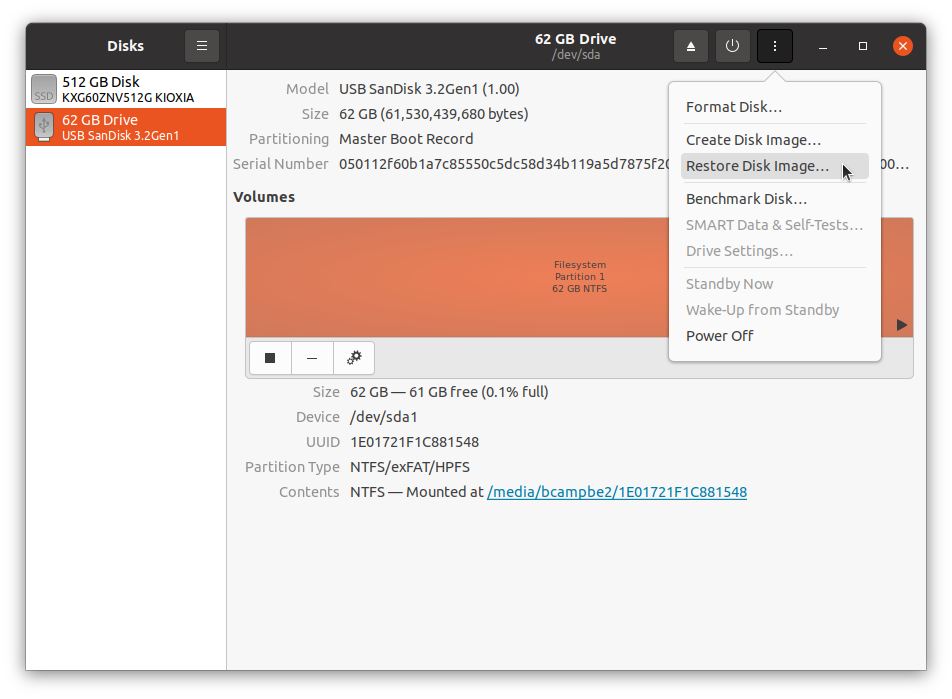

# Installing on a Morello Board

***Please ensure that you have upgraded the Morello board firmware before
proceeding to CheriBSD installation.***

Once you have a disk image, you will either need to write it to a USB stick
to boot an Arm Morello system, or specify it as an argument to an emulator
such as QEMU-CHERI or the Arm Morello FVP.

## Writing an installer disk image to a USB stick

With appropriate substitutions of image filename and target device, the
following command would write the image to a USB stick for use with a Morello
board:

```
dd if=cheribsd-memstick-arm64-aarch64c-22.12.img of=/dev/DISK bs=1048576
```

It is also possible to write a live image to a USB stick, with appropriate
filename substitution.

On systems such as Ubuntu you can also use the GNOME Disks utility to
write to a USB stick:



First select the USB stick in the left pane, then use the menu at the
top right to select "Restore Disk Image...".  It will ask for the
image to write and confirm which device will be written to.  Finally
the eject icon can be used to safely remove the stick before use.

## Installing an Arm Morello system

It is possible to use Arm Morello systems both by booting the live image on a
USB stick, and also by installing to the internal hard disk.
In this section, we describe the how to perform an installation using the
memstick image.

### Starting the boot

Before powering on your Morello board, ensure that the installer USB stick is
inserted into one of the USB ports on the board.
Use the power switch to power the board on, which should lead to firmware
output on the MCC console during a multi-minute initialization and boot cycle.

Once that has completed, you will see Morello firmware output on the Morello
console.
When this message is presented, press Escape to enter the UEFI boot menu:
```
Press ESCAPE for boot options .......
```

At the UEFI menu, select Boot Manager using the cursor keys, and press
Enter:

```
   Select Language            <Standard English>         This selection will
                                                         take you to the
 > Device Manager                                        Device Manager
 > Boot Manager
 > Boot Maintenance Manager

   Continue
   Reset


  ^v=Move Highlight       <Enter>=Select Entry
```

Select your USB stick from the Boot Manager menu using the cursor keys, and
press enter.
In the example below, it is the SanDisk Ultra USB 3.0 device:
```
/------------------------------------------------------------------------------\
|                                Boot Manager                                  |
\------------------------------------------------------------------------------/

                                                         Device Path :
   Boot Manager Menu                                     PcieRoot(0x0)/Pci(0x0,
                                                         0x0)/Pci(0x0,0x0)/Pci(
   UEFI Shell                                            0x14,0x0)/Pci(0x0,0x0)
   UEFI Misc Device                                      /USB(0x5,0x0)
   UEFI WDC WDS240G2G0A-00JH30 2143B2455605
   UEFI PXEv4 (MAC:0002F7009856)
   UEFI HTTPv4 (MAC:0002F7009856)
   UEFI HTTPv6 (MAC:0002F7009856)
   UEFI PXEv6 (MAC:0002F7009856)
   UEFI SanDisk Ultra USB 3.0
   0101cfbb32adfd6c145cd38e7d6164cd167456963c3a71b9f157
   e574567b43d96c6000000000000000000000e49dde42009f1a00
   955581079e275d95
   UEFI Non-Block Boot Device
                                                       v
/------------------------------------------------------------------------------\
|                                                                              |
| ^v=Move Highlight       <Enter>=Select Entry      Esc=Exit                   |
\------------------------------------------------------------------------------/
```

This will be followed by the CheriBSD boot loader and kernel output.
You can press Enter to proceed, or wait for the countdown timer to finish:
```
    _____ _               _ ____   _____ _____
   / ____| |             (_)  _ \ / ____|  __ \
  | |    | |__   ___ _ __ _| |_) | (___ | |  | |
  | |    | '_ \ / _ \ '__| |  _ < \___ \| |  | |
  | |____| | | |  __/ |  | | |_) |____) | |__| |
   \_____|_| |_|\___|_|  |_|____/|_____/|_____/
                                                 ```                        `
                                                s` `.....---.......--.```   -/
 /---------- Welcome to CheriBSD ----------\    +o   .--`         /y:`      +.
 |                                         |     yo`:.            :o      `+-
 |  1. Boot Installer [Enter]              |      y/               -/`   -o/
 |  2. Boot Single user                    |     .-                  ::/sy+:.
 |  3. Escape to loader prompt             |     /                     `--  /
 |  4. Reboot                              |    `:                          :`
 |  5. Cons: Serial                        |    `:                          :`
 |                                         |     /                          /
 |  Options:                               |     .-                        -.
 |  6. Kernel: default/kernel (1 of 1)     |      --                      -.
 |  7. Boot Options                        |       `:`                  `:`
 |                                         |         .--             `--.
 |                                         |            .---.....----.
 \-----------------------------------------/
   Autoboot in 10 seconds. [Space] to pause
```

Note that seperate instances of the installer will run on both the video and
serial consoles.  Care should be taken to ensure that only one is used as
no mechanism is implemented to prevent one from destroying the other's work.

On the serial console, you will eventually be prompted to select a terminal
emulation type:
```
Welcome to FreeBSD!

Please choose the appropriate terminal type for your system.
Common console types are:
   ansi     Standard ANSI terminal
   vt100    VT100 or compatible terminal
   xterm    xterm terminal emulator (or compatible)
   cons25w  cons25w terminal

Console type [xterm]:
```

In most cases, simply hitting Enter will be the right thing to do.
This will enter `bsdinstall`, the interactive FreeBSD installer.

### bsdinstall

`bsdinstall` uses the `libdialog` text interface library.
**Be aware that you will sometimes need to use the space bar, and not enter
key, to select menu options, which many users find confusing.**

Select **Install** at the first menu by hitting Enter:
```
                     ┌────────────Welcome──────────────┐
                     │ Welcome to FreeBSD! Would you   │
                     │ like to begin an installation   │
                     │ or use the live CD?             │
                     ├─────────────────────────────────┤
                     │ <Install> < Shell > <Live CD>   │
                     └─────────────────────────────────┘
```

#### Keymap selection

If you intend only to use the serial console, and not video console, select
the default keymap by hitting Enter at the next menu; otherwise, use the
cursor keys and space bar to select a country-specific keyboard layout:
```
     ┌───────────────────────Keymap Selection──────────────────────────┐
     │ The system console driver for FreeBSD defaults to standard "US" │
     │ keyboard map. Other keymaps can be chosen below.                │
     │ ┌─────────────────────────────────────────────────────────────┐ │
     │ │>>> Continue with default keymap                             │ │
     │ │->- Test default keymap                                      │ │
     │ │( ) Armenian phonetic layout                                 │ │
     │ │( ) Belarusian                                               │ │
     │ │( ) Belgian                                                  │ │
     │ │( ) Belgian (accent keys)                                    │ │
     │ │( ) Brazilian (accent keys)                                  │ │
     │ │( ) Brazilian (without accent keys)                          │ │
     │ │( ) Bulgarian (BDS)                                          │ │
     │ │( ) Bulgarian (Phonetic)                                     │ │
     │ │( ) Canadian Bilingual                                       │ │
     │ └────↓(+)─────────────────────────────────────────────12%─────┘ │
     ├─────────────────────────────────────────────────────────────────┤
     │                   <Select>          <Cancel>                    │
     └──────────────────[Press arrows, TAB or ENTER]───────────────────┘
```

#### Hostname

Press Enter to accept the default hostname, or replace it:
```
           ┌───────────────────Set Hostname──────────────────────┐
           │ Please choose a hostname for this machine.          │
           │                                                     │
           │ If you are running on a managed network, please ask │
           │ your network administrator for an appropriate name. │
           │ ┌─────────────────────────────────────────────────┐ │
           │ │cheribsd                                         │ │
           │ └─────────────────────────────────────────────────┘ │
           ├─────────────────────────────────────────────────────┤
           │                     <  OK  >                        │
           └─────────────────────────────────────────────────────┘
```

#### Partitioning (automatic or manual)

Press Enter to select an automated UFS install:
```
          ┌─────────────────────Partitioning───────────────────────┐
          │ How would you like to partition your disk?             │
          │ ┌────────────────────────────────────────────────────┐ │
          │ │   Auto (UFS)  Guided UFS Disk Setup                │ │
          │ │   Auto (ZFS)  EXPERIMENTAL Guided Root-on-ZFS      │ │
          │ │   Manual      Manual Disk Setup (experts)          │ │
          │ │   Shell       Open a shell and partition by hand   │ │
          │ │                                                    │ │
          │ │                                                    │ │
          │ └────────────────────────────────────────────────────┘ │
          ├────────────────────────────────────────────────────────┤
          │               <  OK  >        <Cancel>                 │
          └────────────────────────────────────────────────────────┘
```

#### Partition (entire disk)

Select Entire Disk and press Enter:

```
                 ┌───────────────Partition──────────────────┐
                 │ Would you like to use this entire disk   │
                 │ (ada0) for FreeBSD or partition it to    │
                 │ share it with other operating systems?   │
                 │ Using the entire disk will erase any     │
                 │ data currently stored there.             │
                 ├──────────────────────────────────────────┤
                 │     <Entire Disk>   < Partition >        │
                 └──────────────────────────────────────────┘
```

#### Partition (entire disk - confirmation)

Press Enter to confirm:
```
                 ┌───────────────Partition──────────────────┐
                 │ Would┌──────Confirmation─────────┐disk   │
                 │ (ada0│ This will erase the disk. │  o    │
                 │ share│ Are you sure you want to  │  s?   │
                 │ Using│ proceed?                  │       │
                 │ data ├───────────────────────────┤       │
                 ├──────│     < Yes >   < No  >     │  ─────┤
                 │     <└───────────────────────────┘       │
                 └────────                             ─────┘
```

#### Partition Editor

Review the proposed partition scheme, select Finish, and then press Enter to
proceed:
```
           ┌──────────────────Partition Editor────────────────────┐
           │ Please review the disk setup. When complete, press   │
           │ the Finish button.                                   │
           │┌────────────────────────────────────────────────────┐│
           ││ada0            224 GB  GPT                         ││
           ││  ada0p1        260 MB  efi            /boot/efi    ││
           ││  ada0p2        220 GB  freebsd-ufs    /            ││
           ││  ada0p3        3.6 GB  freebsd-swap   none         ││
           ││da0             57 GB   GPT                         ││
           ││  da0p1         33 MB   efi                         ││
           ││  da0p2         814 MB  freebsd-ufs                 ││
           ││                                                    ││
           │└────────────────────────────────────────────────────┘│
           ├──────────────────────────────────────────────────────┤
           │<Create> <Delete> <Modify> <Revert> < Auto > <Finish> │
           └──────────────────────────────────────────────────────┘
```

#### Partition editor - confirmation

Select Commit and press Enter to continue with writing out a new partition
table:
```
           ┌──────────────────Partition Editor────────────────────┐
           │ Please review the disk setup. When complete, press   │
           │ the Finish button.                                   │
           │┌────────────────────────────────────────────────────┐│
           │┌──────────────────Confirmation─────────────────────┐││
           ││ Your changes will now be written to disk. If you  │
           ││ have chosen to overwrite existing data, it will   │
           ││ be PERMANENTLY ERASED. Are you sure you want to   │
           ││ commit your changes?                              │
           │├───────────────────────────────────────────────────┤
           ││ <   Commit    > <Revert & Exit> <    Back     >   │
           │└───────────────────────────────────────────────────┘
           │└─
           ├──────────────────────────────────────────────────────┤
           │<Create> <Delete> <Modify> <Revert> < Auto > <Finish> │
           └──────────────────────────────────────────────────────┘
```

#### Setting a root password

Enter a new root password and press Enter.
Then confirm it by typing the same password again and pressing Enter.

```
Please select a password for the system management account (root):
Typed characters will not be visible.
Changing local password for root
New Password:
```

#### Network configuration

If desired, configure Ethernet networking by pressing Enter.

```
  ┌────────────────────────Network Configuration───────────────────────────┐
  │ Please select a network interface to configure:                        │
  │ ┌────────────────────────────────────────────────────────────────────┐ │
  │ │   re0  RealTek 8168/8111 B/C/CP/D/DP/E/F/G PCIe Gigabit Ethernet   │ │
  │ │                                                                    │ │
  │ │                                                                    │ │
  │ └────────────────────────────────────────────────────────────────────┘ │
  ├────────────────────────────────────────────────────────────────────────┤
  │                     <  OK  >           <Cancel>                        │
  └────────────────────────────────────────────────────────────────────────┘
```

#### Network configuration - enabling IPv4

If desired, enable IPv4 on the Ethernet interface by selecting Yes and
pressing Enter:
```
                        ┌──Network Configuration────┐
                        │ Would you like to         │
                        │ configure IPv4 for this   │
                        │ interface?                │
                        ├───────────────────────────┤
                        │     < Yes >   < No  >     │
                        └───────────────────────────┘
```

#### Network configuration - DHCP for IPv4

If you will be using DHCP, select Yes and press Enter.
Otherwise select No and press Enter to perform a manual IPv4 configuration.

```
                        ┌──Network Configuration────┐
                        │ Would you like to use     │
                        │ DHCP to configure this    │
                        │ interface?                │
                        ├───────────────────────────┤
                        │     < Yes >   < No  >     │
                        └───────────────────────────┘
```

#### Network configuration - enabling IPv6

If desired, enable IPv6 on the Ethernet interface by selecting Yes and
pressing Enter:
```
                        ┌──Network Configuration────┐
                        │ Would you like to         │
                        │ configure IPv6 for this   │
                        │ interface?                │
                        ├───────────────────────────┤
                        │     < Yes >   < No  >     │
                        └───────────────────────────┘
```

#### Network configuration - SLAAC for IPv6

Press Enter to use stateless address autoconfiguration for IPv6:
```
                        ┌──Network Configuration────┐
                        │ Would you like to try     │
                        │ stateless address         │
                        │ autoconfiguration         │
                        │ (SLAAC)?                  │
                        ├───────────────────────────┤
                        │     < Yes >   < No  >     │
                        └───────────────────────────┘
```

#### Network configuration - resolver configuration

Enter DNS resolution configuration information, or press Enter to confirm
autoconfigured DNS configuration:
```
   ┌───────────────────────Network Configuration──────────────────────────┐
   │ Resolver Configuration                                               │
   │ ┌──────────────────────────────────────────────────────────────────┐ │
   │ │Search                                                            │ │
   │ │IPv6 DNS #1                                                       │ │
   │ │IPv6 DNS #2                                                       │ │
   │ │IPv4 DNS #1    192.168.4.1                                        │ │
   │ │IPv4 DNS #2                                                       │ │
   │ └──────────────────────────────────────────────────────────────────┘ │
   ├──────────────────────────────────────────────────────────────────────┤
   │                     <  OK  >           <Cancel>                      │
   └──────────────────────────────────────────────────────────────────────┘
```

#### Local or UTC clock

Press Enter to select a system clock on UTC
```
   ┌───────────┤Select local or UTC (Greenwich Mean Time) clock├───────────┐
   │ Is this machine's CMOS clock set to UTC?  If it is set to local time, │
   │ or you don't know, please choose NO here!                             │
   │                                                                       │
   ├───────────────────────────────────────────────────────────────────────┤
   │                          [ Yes  ]   [  No  ]                          │
   └───────────────────────────────────────────────────────────────────────┘
```

#### Timezone selection

Select your continent and press Enter:
```
                     ┌───────┤Time Zone Selector├───────┐
                     │ Select a region                  │
                     │ ┌──────────────────────────────┐ │
                     │ │ 1 Africa                     │ │
                     │ │ 2 America -- North and South │ │
                     │ │ 3 Antarctica                 │ │
                     │ │ 4 Asia                       │ │
                     │ │ 5 Atlantic Ocean             │ │
                     │ │ 6 Australia                  │ │
                     │ │ 7 Europe                     │ │
                     │ │ 8 Indian Ocean               │ │
                     │ │ 9 Pacific Ocean              │ │
                     │ │ 0 UTC                        │ │
                     │ └──────────────────────────────┘ │
                     ├──────────────────────────────────┤
                     │        [  OK  ]   [Cancel]       │
                     └──────────────────────────────────┘
```

Then select your country and press Enter:
```
        ┌────────────────────┤Countries in Europe├────────────────────┐
        │ Select a country or region                                  │
        │ ┌─^^^─────────────────────────────────────────────────────┐ │
        │ │ 35 Poland                                               │ │
        │ │ 36 Portugal                                             │ │
        │ │ 37 Romania                                              │ │
        │ │ 38 Russian Federation                                   │ │
        │ │ 39 San Marino                                           │ │
        │ │ 40 Serbia                                               │ │
        │ │ 41 Slovakia                                             │ │
        │ │ 42 Slovenia                                             │ │
        │ │ 43 Spain                                                │ │
        │ │ 44 Svalbard and Jan Mayen                               │ │
        │ │ 45 Sweden                                               │ │
        │ │ 46 Switzerland                                          │ │
        │ │ 47 Turkey                                               │ │
        │ │ 48 Ukraine                                              │ │
        │ │ 49 United Kingdom of Great Britain and Northern Ireland │ │
        │ │ 50 Åland Islands                                        │ │
        │ └────────────────────────────────────────────────100%─────┘ │
        ├─────────────────────────────────────────────────────────────┤
        │                     [  OK  ]   [Cancel]                     │
        └─────────────────────────────────────────────────────────────┘
```

Confirm your choice by selecting Yes and pressing Enter:
```
   ┌────────────────────────────┤Confirmation├────────────────────────────┐
   │ Does the abbreviation `BST' look reasonable?                         │
   ├──────────────────────────────────────────────────────────────────────┤
   │                          [ Yes  ]   [  No  ]                         │
   └──────────────────────────────────────────────────────────────────────┘
```

#### Setting the date and time

As desired, set the date, or select Skip and press Enter if you plan
to use network time synchronization:
```
                   ┌────────────Time & Date───────────────┐
                   │                                      │
                   │  Month            Year               │
                   │  ┌───────────────┐┌───────────────┐  │
                   │  │May            ││2022           │  │
                   │  └───────────────┘└───────────────┘  │
                   │  ┌─────↑(-)───────────────────────┐  │
                   │  │    Sun Mon Tue Wed Thu Fri Sat │  │
                   │  │ 18   1   2   3   4   5   6   7 │  │
                   │  │ 19   8   9  10  11  12  13  14 │  │
                   │  │ 20  15  16  17  18  19  20  21 │  │
                   │  │ 21  22  23  24  25  26  27  28 │  │
                   │  │ 22  29  30  31                 │  │
                   │  │                                │  │
                   │  └─────↓(+)───────────────────────┘  │
                   ├──────────────────────────────────────┤
                   │       <Set Date>    <  Skip  >       │
                   └──────────────────────────────────────┘
```

And, likewise, the time:
```
                   ┌────────────Time & Date───────────────┐
                   │                                      │
                   │           ┌──┐ ┌──┐ ┌──┐             │
                   │           │00│:│34│:│36│             │
                   │           └──┘ └──┘ └──┘             │
                   │                                      │
                   ├──────────────────────────────────────┤
                   │       <Set Time>    <  Skip  >       │
                   └──────────────────────────────────────┘
```

#### System configuration

As desired, enable any further services (e.g., `ntpd` and `ntpdate`) by
selecting them and hitting Space:
```
  ┌────────────────────────System Configuration───────────────────────────┐
  │ Choose the services you would like to be started at boot:             │
  │ ┌───────────────────────────────────────────────────────────────────┐ │
  │ │ [ ] local_unbound  Local caching validating resolver              │ │
  │ │ [*] sshd           Secure shell daemon                            │ │
  │ │ [ ] moused         PS/2 mouse pointer on console                  │ │
  │ │ [ ] ntpdate        Synchronize system and network time at bootime │ │
  │ │ [ ] ntpd           Synchronize system and network time            │ │
  │ │ [ ] powerd         Adjust CPU frequency dynamically if supported  │ │
  │ │ [*] dumpdev        Enable kernel crash dumps to /var/crash        │ │
  │ │                                                                   │ │
  │ │                                                                   │ │
  │ └───────────────────────────────────────────────────────────────────┘ │
  ├───────────────────────────────────────────────────────────────────────┤
  │                               <  OK  >                                │
  └───────────────────────────────────────────────────────────────────────┘
```

Then press Enter to continue.

#### Add user accounts

If you plan to install the desktop environment in the next step, it is
useful to create user accounts now.
If desired, select Yes and press Enter to add non-root accounts.
Otherwise, select No and press Enter

#### CHERI Desktop environment

If you wish to configure your CheriBSD system with a KDE-based desktop
environment you can do so now.  **NOTE: You must have previously
configured the network and be able to reach pkg.CheriBSD.org.**

```
                      ┌─────────┤CHERI Desktop├────────┐
                      │ Would you like to install the  │
                      │ CHERI desktop environment      │
                      │ (requires network)?            │
                      ├────────────────────────────────┤
                      │      [ Yes  ]     [  No  ]     │
                      └────────────────────────────────┘
```
Select Yes to install (**NOTE: this may take 20-50 minutes depending on
network conditions**).

#### Adding users to video group

In order to be able to use the keyboard and mouse when logged in via the
Simple Desktop Display Manager (SDDM), users must be in the video group.
If users were added earlier, you will be prompted to select ones to add
to the group.

```
                  ┌─────────────┤CHERI Desktop├─────────────┐
                  │ Users must be in the video group to log │
                  │ in to a desktop environment. Choose any │
                  │ additional users to add to the group:   │
                  │ ┌─────────────────────────────────────┐ │
                  │ │       [ ] localuser Local User      │ │
                  │ └─────────────────────────────────────┘ │
                  ├─────────────────────────────────────────┤
                  │                [  OK  ]                 │
                  └─────────────────────────────────────────┘
```
Use Space to select users to add and then press Enter.

#### Final configuration

If there are further configuration settings to change, select an appropriate
option from the menu and press Space.
Otherwise, press Enter to complete the installation:
```
┌───────────────────────────Final Configuration──────────────────────────────┐
│ Setup of your FreeBSD system is nearly complete. You can now modify your   │
│ configuration choices. After this screen, you will have an opportunity to  │
│ make more complex changes using a shell.                                   │
│ ┌────────────────────────────────────────────────────────────────────────┐ │
│ │Exit              Apply configuration and exit installer                │ │
│ │Add User          Add a user to the system                              │ │
│ │Root Password     Change root password                                  │ │
│ │Hostname          Set system hostname                                   │ │
│ │Network           Networking configuration                              │ │
│ │Services          Set daemons to run on startup                         │ │
│ │System Hardening  Set security options                                  │ │
│ │Time Zone         Set system timezone                                   │ │
│ │Handbook          Install FreeBSD Handbook (requires network)           │ │
│ │CHERI Desktop     Install the CHERI desktop environment (requires networ│ │
│ │                                                                        │ │
│ │                                                                        │ │
│ │                                                                        │ │
│ └────────────────────────────────────────────────────────────────────────┘ │
├────────────────────────────────────────────────────────────────────────────┤
│                                 <  OK  >                                   │
└────────────────────────────────────────────────────────────────────────────┘
```

#### Manual configuration

If desired, select Yes and press Enter to drop to a shell before reboot.
Otherwise, select No and press Enter.
```
                   ┌───────Manual Configuration──────────┐
                   │ The installation is now finished.   │
                   │ Before exiting the installer, would │
                   │ you like to open a shell in the new │
                   │ system to make any final manual     │
                   │ modifications?                      │
                   ├─────────────────────────────────────┤
                   │         < Yes >     < No  >         │
                   └─────────────────────────────────────┘
```

### Complete

Select Reboot and press Enter:
```
                        ┌─────────Complete───────────┐
                        │ Installation of FreeBSD    │
                        │ complete! Would you like   │
                        │ to reboot into the         │
                        │ installed system now?      │
                        ├────────────────────────────┤
                        │   <Reboot >  <Live CD>     │
                        └────────────────────────────┘
```

### Rebooting after installation

Remove the USB stick to prevent the installer from running after a system
reboot.
Due to a [Morello firmware bug](../morello-issues/), OS-triggered reboot is
not reliable.
Until a firmware revision correcting this bug is released, you will need to
type `reboot` on the management console to reboot after installation.
CheriBSD will print messages along the following lines once it is safe to
reboot:

```
Waiting (max 60 seconds) for system process `syncer' to stop...
Syncing disks, vnodes remaining... 24 0 0 done
All buffers synced.
Uptime: 3m12s
```

### Logging in

Log in using the username `root` and the password you entered during the
installation process:

```
...
Mounting late filesystems:.
Security policy loaded: MAC/ntpd (mac_ntpd)
Starting ntpd.
Starting cron.
Starting sendmail_submit.
Starting sendmail_msp_queue.
Performing sanity check on sshd configuration.
Starting sshd.
Starting background file system checks in 60 seconds.

Sun May  8 00:13:04 BST
CheriBSD/arm64 (cheribsd) (ttyu0)

login: root
Password:
May  8 00:13:25 cheribsd login[772]: ROOT LOGIN (root) ON ttyu0
Last login: Sat May  7 23:41:04 on ttyu0
FreeBSD 14.0-CURRENT #0 dev-d4897febcde: Tue May  3 13:34:49 BST 2022     rnw24@zeno.sec.cl.cam.ac.uk:/home/rnw24/cheri/build/cheribsd-morello-purecap-build/home/rnw24/cheri/cheribsd/arm64.aarch64c/sys/GENERIC-MORELLO

Welcome to CheriBSD!

CheriBSD extends FreeBSD to implement memory protection and software
compartmentalization features available in CHERI-extended CPUs.

We provide support via a mailing list:
  https://www.cl.cam.ac.uk/research/security/ctsrd/cheri/cheri-lists.html

And also via the CHERI-CPU Slack:
  https://www.cl.cam.ac.uk/research/security/ctsrd/cheri/cheri-slack.html

CheriBSD source may be found at:
  https://github.com/CTSRD-CHERI/cheribsd/

Find out more about about CHERI at https://cheri-cpu.org/
You have new mail.
root@cheribsd:~ #
```

You can now add further users, install SSH keys for remote access, install
packages, and so on.
