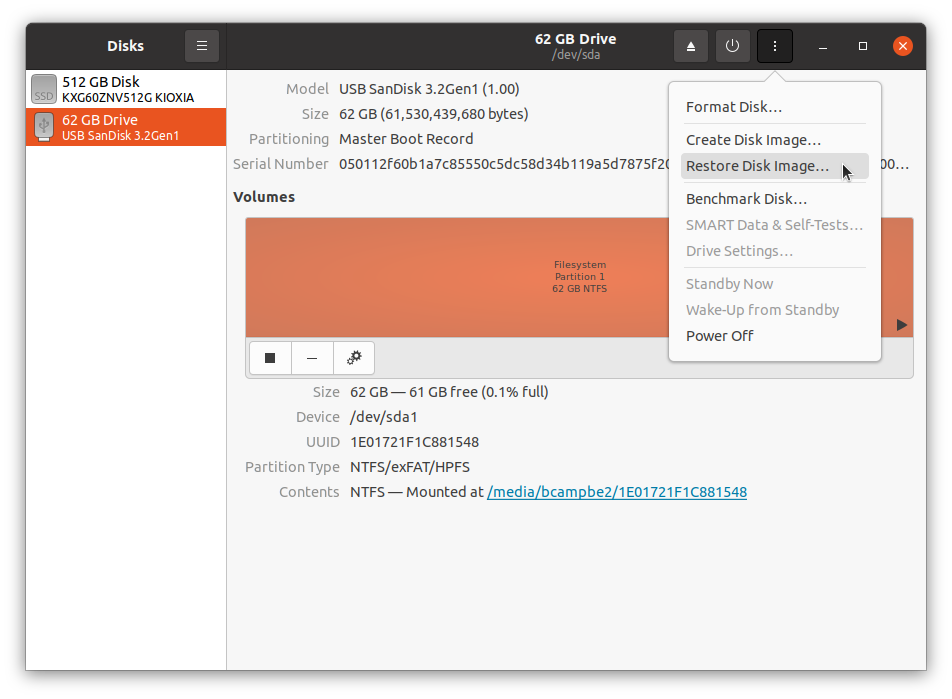

# Installing on a Morello Board

***Please ensure that you have upgraded the Morello board firmware before
proceeding to CheriBSD installation.***

Once you have a disk image, you will either need to write it to a USB stick
to boot an Arm Morello system, or specify it as an argument to an emulator
such as QEMU-CHERI or the Arm Morello FVP.

## Writing an installer disk image to a USB stick

If the image file you have downloaded is compressed (i.e., has a `.xz`
filename suffix), you will need to first decompress the image:

```
unxz cheribsd-memstick-arm64-aarch64c-26.07.img.xz
```

With appropriate substitutions of image filename and target device, the
following command would write the image to a USB stick for use with a Morello
board:

```
dd if=cheribsd-memstick-arm64-aarch64c-26.07.img of=/dev/DISK bs=1M
```

It is also possible to write a live image to a USB stick, with appropriate
filename substitution.

On systems such as Ubuntu you can also use the GNOME Disks utility to
write to a USB stick:



First select the USB stick in the left pane, then use the menu at the
top right to select "Restore Disk Image...".  It will ask for the
image to write and confirm which device will be written to.  Finally
the eject icon can be used to safely remove the stick before use.

## Installing an Arm Morello system

It is possible to use Arm Morello systems both by booting the live image on a
USB stick, and also by installing to the internal hard disk.
In this section, we describe the how to perform an installation using the
memstick image.

### Starting the boot

Before powering on your Morello board, ensure that the installer USB stick is
inserted into one of the USB ports on the board.
Use the power switch to power the board on, which should lead to firmware
output on the MCC console during a multi-minute initialization and boot cycle.

Once that has completed, you will see Morello firmware output on the Morello
console.
When this message is presented, press Escape to enter the UEFI boot menu:
```
Press ESCAPE for boot options .......
```

At the UEFI menu, select Boot Manager using the cursor keys, and press
Enter:

```
   Select Language            <Standard English>         This selection will
                                                         take you to the Boot
 > Device Manager                                        Manager
 > Boot Manager
 > Boot Maintenance Manager

   Continue
   Reset


  ^v=Move Highlight       <Enter>=Select Entry
```

Select your USB stick from the Boot Manager menu using the cursor keys, and
press enter.
In the example below, it is the SanDisk Ultra USB 3.0 device:
```
/------------------------------------------------------------------------------\
|                                Boot Manager                                  |
\------------------------------------------------------------------------------/

                                                         Device Path :
   Boot Manager Menu                                     PcieRoot(0x0)/Pci(0x0,
                                                         0x0)/Pci(0x0,0x0)/Pci(
   UEFI Shell                                            0x14,0x0)/Pci(0x0,0x0)
   UEFI Misc Device                                      /USB(0x5,0x0)
   UEFI WDC WDS240G2G0A-00JH30 2143B2455605
   UEFI PXEv4 (MAC:0002F7009856)
   UEFI HTTPv4 (MAC:0002F7009856)
   UEFI HTTPv6 (MAC:0002F7009856)
   UEFI PXEv6 (MAC:0002F7009856)
   UEFI SanDisk Ultra USB 3.0
   0101cfbb32adfd6c145cd38e7d6164cd167456963c3a71b9f157
   e574567b43d96c6000000000000000000000e49dde42009f1a00
   955581079e275d95
   UEFI Non-Block Boot Device
                                                       v
/------------------------------------------------------------------------------\
|                                                                              |
| ^v=Move Highlight       <Enter>=Select Entry      Esc=Exit                   |
\------------------------------------------------------------------------------/
```

This will be followed by the CheriBSD boot loader and kernel output.
You can press Enter to proceed, or wait for the countdown timer to finish:
```
    _____ _               _ ____   _____ _____
   / ____| |             (_)  _ \ / ____|  __ \
  | |    | |__   ___ _ __ _| |_) | (___ | |  | |
  | |    | '_ \ / _ \ '__| |  _ < \___ \| |  | |
  | |____| | | |  __/ |  | | |_) |____) | |__| |
   \_____|_| |_|\___|_|  |_|____/|_____/|_____/


 /-------- Welcome to CheriBSD ---------\  ```                        `
 |                                      | s` `.....---.......--.```   -/
 |  1. Boot Installer [Enter]           | +o   .--`         /y:`      +.
 |  2. Boot Single user                 |  yo`:.            :o      `+-
 |  3. Escape to loader prompt          |   y/               -/`   -o/
 |  4. Reboot                           |  .-                  ::/sy+:.
 |  5. Cons: Serial                     |  /                     `--  /
 |                                      | `:                          :`
 |  Kernel:                             | `:                          :`
 |  6. kernel (1 of 1)                  |  /                          /
 |                                      |  .-                        -.
 |  Options:                            |   --                      -.
 |  7. Boot Options                     |    `:`                  `:`
 |                                      |      .--             `--.
 \--------------------------------------/         .---.....----.
   Autoboot in 10 seconds. [Space] to pause
```

Note that seperate instances of the installer will run on both the video and
serial consoles.  Care should be taken to ensure that only one is used as
no mechanism is implemented to prevent one from destroying the other's work.

On the serial console, you will eventually be prompted to select a terminal
emulation type:
```
Welcome to FreeBSD!

Please choose the appropriate terminal type for your system.
Common console types are:
   ansi     Standard ANSI terminal
   vt100    VT100 or compatible terminal
   xterm    xterm terminal emulator (or compatible)

Console type [xterm]:
```

In most cases, simply hitting Enter will be the right thing to do.
This will enter `bsdinstall`, the interactive FreeBSD installer.

### bsdinstall

`bsdinstall` uses the `libdialog` text interface library.
**Be aware that you will sometimes need to use the space bar, and not enter
key, to select menu options, which many users find confusing.**

Select **Install** at the first menu by hitting Enter:
```
                  ┌────────────────┤Welcome├────────────────┐
                  │ Welcome to FreeBSD! Would you like to   │
                  │ begin an installation or use the live   │
                  │ system?                                 │
                  ├─────────────────────────────────────────┤
                  │[  Install  ] [   Shell   ] [Live System]│
                  └─────────────────────────────────────────┘
```

#### Keymap selection

If you intend only to use the serial console, and not video console, select
the default keymap by hitting Enter at the next menu; otherwise, use the
cursor keys and space bar to select a country-specific keyboard layout:
```
      ┌───────────────────────┤Keymap Selection├────────────────────────┐
      │ The system console driver for FreeBSD defaults to standard "US" │
      │ keyboard map. Other keymaps can be chosen below.                │
      │ ┌─────────────────────────────────────────────────────────────┐ │
      │ │>>> Continue with default keymap                             │ │
      │ │->- Test default keymap                                      │ │
      │ │( ) Armenian phonetic layout                                 │ │
      │ │( ) Belarusian                                               │ │
      │ │( ) Belgian                                                  │ │
      │ │( ) Belgian (accent keys)                                    │ │
      │ │( ) Brazilian (accent keys)                                  │ │
      │ │( ) Brazilian (without accent keys)                          │ │
      │ │( ) Bulgarian (BDS)                                          │ │
      │ │( ) Bulgarian (Phonetic)                                     │ │
      │ │( ) Canadian Bilingual                                       │ │
      │ └─↓↓↓──────────────────────────────────────────────────── 12%─┘ │
      ├─────────────────────────────────────────────────────────────────┤
      │                      [Select]     [Cancel]                      │
      └────────────────── Press arrows, TAB or ENTER ───────────────────┘
```

#### Hostname

Press Enter to accept the default hostname, or replace it:
```
            ┌───────────────────┤Set Hostname├────────────────────┐
            │ Please choose a hostname for this machine.          │
            │                                                     │
            │ If you are running on a managed network, please ask │
            │ your network administrator for an appropriate name. │
            │ ┌─────────────────────────────────────────────────┐ │
            │ │cheribsd                                         │ │
            │ └─────────────────────────────────────────────────┘ │
            ├─────────────────────────────────────────────────────┤
            │                      [  OK  ]                       │
            └─────────────────────────────────────────────────────┘
```

#### Partitioning (automatic or manual)

This tutorial assumes that you are performing a fresh install, or a complete
reinstall of your Morello system, with the intention of booting only CheriBSD.
It also assumes that you will be using the ZFS file system.
If these assumpsions are not true, read the FreeBSD documentation for more
information on partitioning disks before proceeding.

Press Enter to select an automated ZFS install:
```
              ┌─────────────────┤Partitioning├──────────────────┐
              │ How would you like to partition your disk?      │
              │ ┌─────────────────────────────────────────────┐ │
              │ │Auto (ZFS) Guided Root-on-ZFS                │ │
              │ │Auto (UFS) Guided UFS Disk Setup             │ │
              │ │Manual     Manual Disk Setup (experts)       │ │
              │ │Shell      Open a shell and partition by hand│ │
              │ └─────────────────────────────────────────────┘ │
              ├─────────────────────────────────────────────────┤
              │              [  OK  ]     [Cancel]              │
              └─────────────────────────────────────────────────┘
```

Note that some advanced ZFS features are experimental and not well-tested on
CHERI.
Please see the release notes for caveats before deviating from the default
configuration used in this guide.

#### ZFS configuration (configure options)

Press Enter to select Install (the next steps will prompt for any disks to
use):

```
           ┌──────────────────┤ZFS Configuration├──────────────────┐
           │ Configure Options:                                    │
           │ ┌───────────────────────────────────────────────────┐ │
           │ │ >>> Install         Proceed with Installation     │ │
           │ │ T Pool Type/Disks:  stripe: 0 disks               │ │
           │ │ - Rescan Devices    *                             │ │
           │ │ - Disk Info         *                             │ │
           │ │ N Pool Name         zroot                         │ │
           │ │ 4 Force 4K Sectors? YES                           │ │
           │ │ E Encrypt Disks?    NO                            │ │
           │ │ P Partition Scheme  GPT (UEFI)                    │ │
           │ │ S Swap Size         4g                            │ │
           │ │ M Mirror Swap?      NO                            │ │
           │ │ W Encrypt Swap?     NO                            │ │
           │ │ O ZFS Pool Options  -O compress=lz4 -O atime=off  │ │
           │ └───────────────────────────────────────────────────┘ │
           ├───────────────────────────────────────────────────────┤
           │                 [Select]     [Cancel]                 │
           └──── Use alnum, arrows, punctuation, TAB or ENTER ─────┘
```

#### ZFS configuration (virtual device type)

Press Enter to select stripe:
```
                ┌─────────────┤ZFS Configuration├─────────────┐
                │ Select Virtual Device type:                 │
                │ ┌─────────────────────────────────────────┐ │
                │ │ stripe Stripe - No Redundancy           │ │
                │ │ mirror Mirror - n-Way Mirroring         │ │
                │ │ raid10 RAID 1+0 - n x 2-Way Mirrors     │ │
                │ │ raidz1 RAID-Z1 - Single Redundant RAID  │ │
                │ │ raidz2 RAID-Z2 - Double Redundant RAID  │ │
                │ │ raidz3 RAID-Z3 - Triple Redundant RAID  │ │
                │ └─────────────────────────────────────────┘ │
                ├─────────────────────────────────────────────┤
                │            [  OK  ]     [Cancel]            │
                └──────── Press arrows, TAB or ENTER ─────────┘
```

#### ZFS configuration (disks)

Use the arrow keys and Space to select the disks to use:
```
            ┌─────────────────┤ZFS Configuration├────────────────┐
            │ Please select one or more disks to create a zpool: │
            │ ┌────────────────────────────────────────────────┐ │
            │ │         [X] ada0 WDC WDS240G2G0A-00JH30        │ │
            │ └────────────────────────────────────────────────┘ │
            ├────────────────────────────────────────────────────┤
            │                [  OK  ]     [ Back ]               │
            └────────── Use arrows, SPACE, TAB or ENTER ─────────┘
```

#### ZFS configuration (confirmation)

Select YES and press Enter to confirm:
```
              ┌───────────────┤ZFS Configuration├──────────────┐
              │ Last Chance! Are you sure you want to destroy  │
              │ the current contents of the following disks:   │
              │                                                │
              │  ada0                                          │
              │                                                │
              ├────────────────────────────────────────────────┤
              │              [ YES  ]     [  NO  ]             │
              └────────── Press arrows, TAB or ENTER ──────────┘
```

#### The installation proceeds

The installer will now proceed to check distribution files and unpack them
onto the disk.
Unless something goes wrong, no user interaction is required.
Typical output from the installation process will look like this:

```
 ┌──────────────────────────┤Checksum Verification├─────────────────────────┐
 │ base.txz                                                 [ In Progress ] │
 │ kernel.txz                                               [   Pending   ] │
 │ base-dbg.txz                                             [   Pending   ] │
 │ kernel-dbg.txz                                           [   Pending   ] │
 │ kernel.GENERIC-MORELLO-NODEBUG-dbg.txz                   [   Pending   ] │
 │ kernel.GENERIC-MORELLO-NODEBUG.txz                       [   Pending   ] │
 │ kernel.GENERIC-MORELLO-PURECAP-BENCHMARK-NODEBUG-dbg.txz [   Pending   ] │
 │ kernel.GENERIC-MORELLO-PURECAP-BENCHMARK-NODEBUG.txz     [   Pending   ] │
 │ kernel.GENERIC-MORELLO-PURECAP-BENCHMARK-dbg.txz         [   Pending   ] │
 │ kernel.GENERIC-MORELLO-PURECAP-BENCHMARK.txz             [   Pending   ] │
 │ kernel.GENERIC-MORELLO-PURECAP-NODEBUG-dbg.txz           [   Pending   ] │
 │ kernel.GENERIC-MORELLO-PURECAP-NODEBUG.txz               [   Pending   ] │
 │ ...                                                                      │
 │                                                                          │
 │ Verifying checksums of selected distributions.                           │
 │                                                                          │
 │  ┌─Overall Progress───────────────────────────────────────────────────┐  │
 │  │                                  0%                                │  │
 │  └────────────────────────────────────────────────────────────────────┘  │
 └──────────────────────────────────────────────────────────────────────────┘
```

#### Updating the EFI configuration table

If you are reinstalling a Morello box with an existing OS install, you may be
prompted to update the boot configuration.
Press Enter to proceed:

```
                    ┌────────┤Boot Configuration├────────┐
                    │ There are multiple "FreeBSD" EFI   │
                    │ boot entries. Would you like to    │
                    │ remove them all and add a new one? │
                    ├────────────────────────────────────┤
                    │        [ Yes  ]     [  No  ]       │
                    └────────────────────────────────────┘
```

#### Setting a root password

Enter a new root password and press Enter.
Then confirm it by typing the same password again and pressing Enter:

```
Please select a password for the system management account (root):
Typed characters will not be visible.
Changing local password for root
New Password:
Retype New Password:
```

#### Network configuration

If desired, configure Ethernet networking by pressing Enter to select Auto:

```
      ┌─────────────────────┤Network Configuration├─────────────────────┐
      │ Please select a network interface and configuration mode:       │
      │ ┌─────────────────────────────────────────────────────────────┐ │
      │ │re0 RealTek 8168/8111 B/C/CP/D/DP/E/F/G PCIe Gigabit Ethernet│ │
      │ └─────────────────────────────────────────────────────────────┘ │
      ├─────────────────────────────────────────────────────────────────┤
      │               [ Auto ]     [Manual]     [Cancel]                │
      └─────────────────────────────────────────────────────────────────┘
```

If this fails (e.g. your network requires static configuration), you may be
asked to provide additional information, or you may need to retry selecting
Manual.

#### Timezone selection

Press Enter to select UTC as your timezone; otherwise, select your continent
and press Enter:
```
                      ┌──────┤Time Zone Selector├───────┐
                      │ Select a region                 │
                      │ ┌─────────────────────────────┐ │
                      │ │0  UTC                       │ │
                      │ │1  Africa                    │ │
                      │ │2  America -- North and South│ │
                      │ │3  Antarctica                │ │
                      │ │4  Arctic Ocean              │ │
                      │ │5  Asia                      │ │
                      │ │6  Atlantic Ocean            │ │
                      │ │7  Australia                 │ │
                      │ │8  Europe                    │ │
                      │ │9  Indian Ocean              │ │
                      │ │10 Pacific Ocean             │ │
                      │ └─────────────────────────────┘ │
                      ├─────────────────────────────────┤
                      │      [  OK  ]     [Cancel]      │
                      └─────────────────────────────────┘
```

If you have not selected UTC, select your country and press Enter:
```
         ┌───────────────────┤Countries in Europe├───────────────────┐
         │ Select a country or region                                │
         │ ┌───────────────────────────────────────────────────────┐ │
         │ │1  Albania                                             │ │
         │ │2  Andorra                                             │ │
         │ │3  Austria                                             │ │
         │ │4  Belarus                                             │ │
         │ │5  Belgium                                             │ │
         │ │6  Bosnia and Herzegovina                              │ │
         │ │7  Bulgaria                                            │ │
         │ │8  Croatia                                             │ │
         │ │9  Cyprus                                              │ │
         │ │10 Czech Republic                                      │ │
         │ │11 Denmark                                             │ │
         │ │12 Estonia                                             │ │
         │ │13 Finland                                             │ │
         │ │14 France                                              │ │
         │ │15 Germany                                             │ │
         │ │16 Gibraltar                                           │ │
         │ └─↓↓↓────────────────────────────────────────────── 32%─┘ │
         ├───────────────────────────────────────────────────────────┤
         │                   [  OK  ]     [Cancel]                   │
         └───────────────────────────────────────────────────────────┘
```

Confirm your choice by selecting Yes and pressing Enter:
```
   ┌────────────────────────────┤Confirmation├────────────────────────────┐
   │ Does the timezone abbreviation `UTC' look reasonable?                │
   ├──────────────────────────────────────────────────────────────────────┤
   │                         [ Yes  ]     [  No  ]                        │
   └──────────────────────────────────────────────────────────────────────┘
```

#### Setting the date and time

As desired, set the date, or select Skip and press Enter if you plan
to use network time synchronization:
```
                   ┌─────────────┤Time & Date├────────────┐
                   │  Month            Year               │
                   │  ┌───────────────┐┌───────────────┐  │
                   │  │           July││           2026│  │
                   │  └───────────────┘└───────────────┘  │
                   │  ┌────────────────────────────────┐  │
                   │  │    Sun Mon Tue Wed Thu Fri Sat │  │
                   │  │                 1   2   3   4  │  │
                   │  │     5   6   7   8   9  10  11  │  │
                   │  │    12  13  14  15  16  17  18  │  │
                   │  │    19  20  21  22  23  24  25  │  │
                   │  │    26  27  28  29  30  31      │  │
                   │  │                                │  │
                   │  └────────────────────────────────┘  │
                   ├──────────────────────────────────────┤
                   │       [Set Date]     [  Skip  ]      │
                   └──────────────────────────────────────┘
```

And, likewise, the time:
```
                   ┌─────────────┤Time & Date├────────────┐
                   │            ┌──┐ ┌──┐ ┌──┐            │
                   │            │11│:│59│:│41│            │
                   │            └──┘ └──┘ └──┘            │
                   ├──────────────────────────────────────┤
                   │       [Set Time]     [  Skip  ]      │
                   └──────────────────────────────────────┘
```

#### System configuration

As desired, enable any further services (e.g., `ntpd` and `ntpd_sync_on_start`) by
selecting them and hitting Space:
```
┌───────────────────────────┤System Configuration├───────────────────────────┐
│ Choose the services you would like to be started at boot:                  │
│ ┌────────────────────────────────────────────────────────────────────────┐ │
│ │[ ] local_unbound      Local caching validating resolver                │ │
│ │[X] sshd               Secure shell daemon                              │ │
│ │[ ] moused             PS/2 mouse pointer on console                    │ │
│ │[ ] ntpd               Synchronize system and network time              │ │
│ │[ ] ntpd_sync_on_start Sync time on ntpd startup, even if offset is high│ │
│ │[ ] powerd             Adjust CPU frequency dynamically if supported    │ │
│ │[X] dumpdev            Enable kernel crash dumps to /var/crash          │ │
│ │[ ] debugger_on_panic  Run debugger on kernel panic                     │ │
│ └────────────────────────────────────────────────────────────────────────┘ │
├────────────────────────────────────────────────────────────────────────────┤
│                                  [  OK  ]                                  │
└────────────────────────────────────────────────────────────────────────────┘
```

Then press Enter to continue.

#### Firmware

The installer will detect no firmware is needed for the system and
automatically proceed to the next step after 5 seconds:
```
                   ┌────┤FreeBSD Firmware Installation├────┐
                   │ No firmware to install, continuing... │
                   │  ┌─────────────────────────────────┐  │
                   │  │                5                │  │
                   │  └─────────────────────────────────┘  │
                   ├───────────────────────────────────────┤
                   │               [  OK  ]                │
                   └──────── Press OK to continue ─────────┘
```

#### Add user accounts

If you plan to install the desktop environment in the next step, it is
useful to create user accounts now.
If desired, select Yes and press Enter to add non-root accounts.
Otherwise, select No and press Enter:

```
                       ┌──────┤Add User Accounts├─────┐
                       │ Would you like to add users  │
                       │ to the installed system now? │
                       ├──────────────────────────────┤
                       │     [ Yes  ]    [  No  ]     │
                       └──────────────────────────────┘
```

If you add non-root users, we recommend adding them to the `wheel`,
`operator`, and `video` groups to allow them to manage the system as well as
use the desktop environment.

#### CHERI Desktop environment

If you wish to configure your CheriBSD system with a KDE-based desktop
environment you can do so now.  **NOTE: You must have previously
configured the network and be able to reach pkg.CheriBSD.org.**

```
                      ┌─────────┤CHERI Desktop├────────┐
                      │ Would you like to install the  │
                      │ CHERI desktop environment      │
                      │ (requires network)?            │
                      ├────────────────────────────────┤
                      │      [ Yes  ]     [  No  ]     │
                      └────────────────────────────────┘
```
Select Yes to install (**NOTE: this may take 20-50 minutes depending on
network conditions**).

#### Virtualization support

If you wish to configure your CheriBSD system to support `bhyve`-based,
CHERI-enabled virtual machines, press Enter:

```
                      ┌───────┤CHERI VM Support├────────┐
                      │ Would you like to install CHERI │
                      │ virtual machine support         │
                      │ (requires network)?             │
                      ├─────────────────────────────────┤
                      │      [ Yes  ]     [  No  ]      │
                      └─────────────────────────────────┘
```

#### Final configuration

If there are further configuration settings to change, use the up/down arrow
keys to highlight an appropriate option from the menu and press Enter.
Otherwise, with Finish highlighted, press Enter to complete the installation:
```
┌────────────────────────────┤Final Configuration├───────────────────────────┐
│ Setup of your FreeBSD system is nearly complete. You can now modify your   │
│ configuration choices. After this screen, you will have an opportunity to  │
│ make more complex changes using a shell.                                   │
│ ┌────────────────────────────────────────────────────────────────────────┐ │
│ │Finish           Apply configuration and exit installer                 │ │
│ │Add User         Add a user to the system                               │ │
│ │Root Password    Change root password                                   │ │
│ │Hostname         Set system hostname                                    │ │
│ │Network          Networking configuration                               │ │
│ │Services         Set daemons to run on startup                          │ │
│ │System Hardening Set security options                                   │ │
│ │Time Zone        Set system timezone                                    │ │
│ │Firmware         Install Firmware (requires network)                    │ │
│ │Handbook         Install FreeBSD Handbook (requires network)            │ │
│ │CHERI Desktop    Install the CHERI desktop environment (requires network│ │
│ └─↓↓↓─────────────────────────────────────────────────────────────── 91%─┘ │
├────────────────────────────────────────────────────────────────────────────┤
│                                  [Select]                                  │
└────────────────────────────────────────────────────────────────────────────┘
```

#### Manual configuration

If desired, select Yes and press Enter to drop to a shell before reboot.
Otherwise, select No and press Enter.
```
                 ┌──────────┤Manual Configuration├──────────┐
                 │ The installation is now finished. Before │
                 │ exiting the installer, would you like to │
                 │ open a shell in the new system to make   │
                 │ any final manual modifications?          │
                 ├──────────────────────────────────────────┤
                 │           [ Yes  ]     [  No  ]          │
                 └──────────────────────────────────────────┘
```

### Complete

Select Reboot and press Enter:
```
                  ┌───────────────┤Complete├────────────────┐
                  │ Installation of FreeBSD complete! Would │
                  │ you like to reboot into the installed   │
                  │ system now?                             │
                  ├─────────────────────────────────────────┤
                  │[  Reboot   ] [ Shutdown  ] [Live System]│
                  └─────────────────────────────────────────┘
```

### Rebooting after installation

Remove the USB stick to prevent the installer from running after a system
reboot.
If you have issues with reliabity rebooting your Morello box, confirm that you
are using a recent Morello firmware revision due to [a known firmware
bug](../morello-issues/) in earlier versions that made OS-triggered reboot
unreliable.

### Logging in

Log in using the username `root` and the password you entered during the
installation process:

```
...
Performing sanity check on sshd configuration.
Starting sshd.
Starting background file system checks in 60 seconds.

Wed Jul 22 12:03:31 UTC 2026

CheriBSD/arm64 (cheribsd) (ttyu0)

login: root
Password:
Jul 22 12:03:41 cheribsd login[2005]: ROOT LOGIN (root) ON ttyu0
FreeBSD 15.0-CURRENT (GENERIC-MORELLO-PURECAP) #0 releng/26.07-88f39900c329: Tue Jul 21 10:20:31 UTC 2026

Welcome to CheriBSD!

CheriBSD extends FreeBSD to implement memory protection and software
compartmentalization features enabled by CHERI-extended CPUs.

The CheriBSD front page:
  https://www.cheribsd.org/

We provide support via a mailing list:
  https://www.cl.cam.ac.uk/research/security/ctsrd/cheri/cheri-lists.html

And also via the CHERI-CPU Slack:
  https://www.cl.cam.ac.uk/research/security/ctsrd/cheri/cheri-slack.html

CheriBSD source may be found at:
  https://github.com/CTSRD-CHERI/cheribsd/

Find out more about about CHERI at https://cheri-cpu.org/

WARNING: INVARIANTS kernel option defined, expect reduced performance
WARNING: WITNESS kernel option defined, expect reduced performance
WARNING: capability revocation enabled by default, this may affect performance
root@cheribsd:~ #
```

You can now add further users, install SSH keys for remote access, install
packages, and so on.
